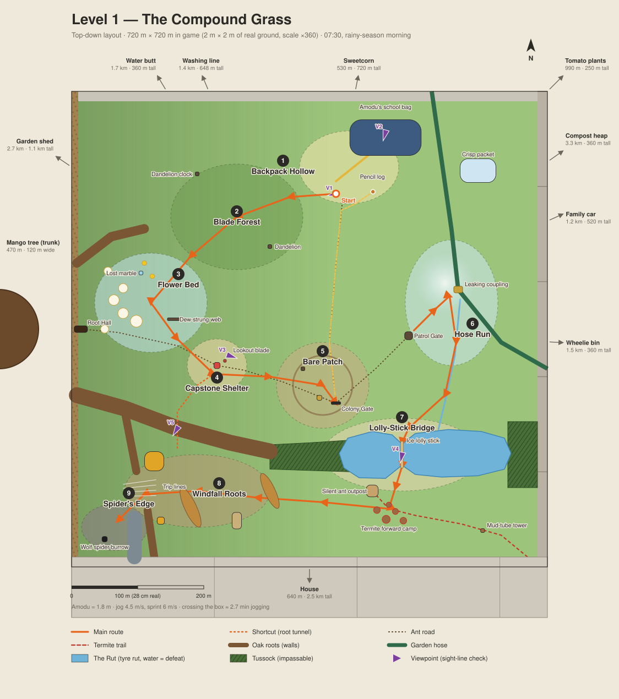

# World Bible: Level 1, The Lawn

Coordinates, sizes and routes live in [`world/lawn/layout.json`](../world/lawn/layout.json), the single source of truth. The map [`docs/lawn_map.svg`](lawn_map.svg) is drawn from it. After any layout change, run:

```bash
python3 tools/lawn_layout.py check && python3 tools/lawn_layout.py render
```

`check` proves the south is sealed without the bridge, every area is reachable with it, and no route passes through a wall.

---

## 1. Premise

Amodu was sitting on the lawn under the Big Oak, hiding from his bully, when Opigo and Opumie's shrinking potion hit the wrong boy. He wakes up 5 mm tall in the flattened grass where he was sitting, next to his own backpack, which is now a mountain.

The world is his real backyard. Nothing is invented fantasy terrain. Every cliff, lake and tower is something ordinary seen from 5 mm up.

## 2. Pillars

1. **Everything is big.** Every main path shows a familiar object at an unfamiliar scale at least once a minute.
2. **Somebody already lives here.** The insects have a civilization built from human junk: roads, gates, posts, shrines. Amodu is the stranger.
3. **It is one real place.** The layout obeys backyard logic: the puddle fills a mower rut, the dew lingers in the oak's shade, the dead patch is where a flower pot stood. If a player asks "why is that there?", there is an answer.
4. **Danger has a direction.** The compost steam is always visible to the south-east, and the termites come from that side.

## 3. Scale

**Amodu is 5 mm tall = 1.8 m in game. Everything is ×360.** One real centimetre is 3.6 m. Godot units are metres.

| Real thing | Real size | In game | Reads as |
|---|---|---|---|
| Worker ant / termite | 5 mm | 1.8 m | A peer, not a monster |
| Dew drop | 1–5 mm | 0.4–1.8 m | Glass boulder |
| Pill bug (young / adult) | 8–12 mm | 2.9–4.3 m | Armoured boar |
| Mowed grass blade | 5–8 cm tall, 4 mm wide | 18–29 m tall, 1.4 m wide | Forest of towers |
| Clover leaflet | 1.5 cm | 5.4 m | Umbrella canopy |
| Pebble | 1–4 cm | 3.6–14 m | Boulder to cliff |
| Quarter (coin) | 24 mm | 8.6 m | Town plaza |
| Lego 2×4 brick | 32 × 16 × 11 mm | 11.5 × 5.8 × 4 m | One-storey building |
| Bottle cap | 30 mm × 6 mm | 10.8 m × 2.2 m | Roof / pavilion |
| Hair tie | 4 cm | 14 m | Gate arch |
| Popsicle stick | 114 × 10 × 2 mm | 41 × 3.6 × 0.7 m | Bridge |
| Garden hose | 18 mm thick | 6.5 m | Pipeline / aqueduct |
| Acorn | 25 mm | 9 m | Boulder |
| Oak leaf | 10–12 cm | 36–43 m | Ground sheet, crunchy |
| Pencil | 19 cm | 68 m | Fallen log |
| Wolf spider | 25 mm body, 50 mm legs | 9 m body, 18 m span | Boss |
| Earthworm | 15 cm | 54 m | Ambient giant |
| Backpack | 42 × 30 × 15 cm | 151 × 108 × 54 m | Mountain |
| Robin | 25 cm | 90 m | Sky predator |
| Sunflower | 2 m | 720 m | Skyscraper |
| Fence | 1.8 m | 648 m | Edge of the world |
| Adult human | 1.8 m | 648 m | Earthquake |
| House | 9 m to ridge | 3.2 km | Mountain range with windows |

Speed follows scale: Amodu runs at about 6 m/s, so crossing the 720 m level takes about 2 minutes. Creature speeds should be scaled from the real animal where possible. A real wolf spider sprints about 0.5 m/s, which is **180 m/s** in game, so the boss must be staged, not simulated.

## 4. Where the level sits

The Lawn is a **2 m × 2 m patch** in the middle of the back lawn, **720 m × 720 m** in game. North is −Z.

| Direction | What's there | In-game distance / size |
|---|---|---|
| North (edge) | 8 cm concrete step up to the patio | 29 m cliff |
| North | Patio and grill, then the house | Grill 1.1 km; house 2.2 km away, 3.2 km tall |
| North-west | The deck (Zone 3 lives under it) | 2.7 km |
| North-east | Parked lawn mower | 1.3 km, 360 m tall |
| East (edge) | Garden stepping stones | 144 m slabs, 18 m tall |
| East | Birdbath | 1.5 km, 252 m tall |
| South (edge) | Brick edging of the garden bed | 22 m wall |
| South | Sunflower row (Zone 2 teaser) | 530 m, 720 m tall |
| South-east | Tomato plants, then the compost pile with its steam | 1 km; 3.3 km |
| South-west | Shed | 3.3 km, 800 m tall |
| West (edge) | Big Oak trunk and leaf-litter drifts | Trunk 470 m away, 216 m wide |

**The Big Oak's canopy covers the whole level**, as a ceiling of leaves 1.1 km up. The open sky is to the east. This drives the lighting (section 9).

## 5. Layout



### Regions and gating
- **North and west (free roam):** Backpack Hollow, Blade Forest, Dewdrop Garden, Capstone Shelter.
- **Center:** the Bare Patch and the Colony Gate, the hub.
- **East:** the Hose Run.
- **South (gated):** Oak Rootlands and Spider's Edge.

The south is sealed by a continuous barrier: the **Great Root** (west), a **tussock band** (center), **the Rut** puddle (center-east), and more tussock at the east edge. The only ways across are the **Popsicle Bridge** and the **root tunnel**, a shortcut opened from the south side.

### The nine areas
| # | Area | Center (x, z) | Role | Why it's there |
|---|---|---|---|---|
| 1 | Backpack Hollow | 60, −245 | Wake-up; movement and camera tutorial | The grass Amodu flattened by sitting. His backpack is 150 m tall beside it. |
| 2 | Blade Forest | −110, −170 | First scale reveal | Densest walkable grass; dandelion towers; first ant trail |
| 3 | Dewdrop Garden | −240, −40 | The level's wow moment | Oak shade keeps the dew all morning. Clover canopy, a lost marble, a dew-strung web. |
| 4 | Capstone Shelter | −140, 55 | Meet Opigo and Opumie | Ant watch post under a bottle cap on three pebbles, with a 25 m lookout |
| 5 | Bare Patch | 20, 85 | Pill bug fight; Colony Gate | A flower pot stood here all last summer. Its ring is pressed in the soil, the soil cracked, and the ants' front door is the biggest crack. |
| 6 | Hose Run | 215, −40 | Garden Patrol; water spectacle | The coupling leaks a jet; its mist makes a permanent rainbow. Ant water station. |
| 7 | Popsicle Bridge | 140, 190 | The crossing south | Runoff flooded the rut the mower wheel left. The stick spans its 36 m neck. |
| 8 | Oak Rootlands | −170, 245 | Stealth; spider ambush | Acorn boulders; oak leaves that crunch and give you away |
| 9 | Spider's Edge | −295, 300 | Wolf Spider boss | Damp corner where the root dives under the edging. Silk-lined burrow, trip lines. |

**Route A** (wake → Colony Gate) is 677 m. **Route B** (Patrol Gate → Spider's Edge) is 886 m. Both are straight-line lengths; real play time is set by encounters and story.

### Key landmarks
- **Amodu's backpack** (115, −290): 151 × 54 m base, 150 m tall. Zipper climb on the south face; its summit (V2) overlooks the whole level.
- **Oak Root Hall** (−346, 0): quest hub between two buttress roots at the trunk base. Sealed until after the colony.
- **Colony Gate** (40, 112): a hair tie arched over the crack, with a quarter as its plaza.
- **Patrol Gate** (150, 10): the colony's side exit under a pebble.
- **Leaking coupling** (225, −60): brass, 11 m, jet spraying up and west.
- **Popsicle stick** (140, 190): 41 m, with a faded printed joke readable underfoot.

## 6. Story mapping (PDF Chapter 1)

| PDF stage | Where |
|---|---|
| 3 Bully Incident, 4 Transformation | Opening cutscene at human scale, at this exact spot under the oak. The same shot then cuts to ant scale. |
| 5 First Steps | Backpack Hollow → Blade Forest → Dewdrop Garden |
| 2 Meet the Musketeers | Capstone Shelter |
| 1 Tutorial Fight (pill bugs) | Bare Patch |
| 6 Into the Anthill | Colony Gate |
| 7 Prove Your Worth | Colony interior (separate scene, not in this map) |
| 8 Garden Patrol | Patrol Gate → Hose Run → Popsicle Bridge |
| 9 Spider Ambush | Oak Rootlands |
| 10 BOSS: Garden Wolf Spider | Spider's Edge |

**Change from the PDF:** stages 1–2 are swapped so Amodu meets his guides before his first fight.

**The Lawn is reused in Chapter 2 ("War Comes Home").** In Chapter 1 the termite camp south of the Rut is only evidence: chewed stakes, mud tubes, a silent ant outpost. In Chapter 2 it's occupied, and the bridge becomes the PDF's "Popsicle Stick Bridge" stage. The same map ages between chapters.

## 7. The civilization layer

- **Ant roads:** worn trails through the grass with blades cut back. They link the Colony Gate to Capstone, Oak Root Hall, the backpack and the Patrol Gate.
- **Pheromone trails:** faint shimmering lines along ant roads that Amodu learns to read. This is navigation built into the world; any HUD marker is optional.
- **Junk architecture:** thread rope ladders, staple gates, matchstick palisades, a stud-earring shrine at Capstone, the hair-tie Colony Gate, the coin plaza, an abandoned Lego waystation.
- **Termite occupation:** mud tubes, chewed wood, silent ant posts. It gets thicker toward the south-east and follows a trail in over the edging from the compost direction.

## 8. Hazards and events in the Lawn

| Hazard | Where | Notes |
|---|---|---|
| Falling dew drops | Dewdrop Garden | 1 m water boulders; readable shadow before impact |
| Coupling jet and mist | Hose Run | Pushes the player; the mist cuts visibility |
| The Rut | Popsicle Bridge | Falling in is defeat (surface tension). Wind gusts on the stick. |
| Falling acorns | Oak Rootlands | Rare, loud, telegraphed by a shadow |
| Crunchy leaves | Oak Rootlands | Noise alerts enemies |
| Robin shadow | Bare Patch | Open ground; it hunts the worm casts; hide or be taken |
| Footsteps | Anywhere | A human crossing the lawn: ground shake, 97 m footprint |
| Mower | Skyline only | Parked. Foreshadowing, not a Level 1 event. |

## 9. Light and time

- **Default: 07:30, early summer.** The sun is low in the east-north-east (azimuth ≈75°, elevation ≈15°).
- Because the canopy is 1.1 km up and open to the east, **the morning sun rakes in under the leaves**: long golden light, 90 m grass shadows, god rays through the blades.
- **Noon:** the sun is above the canopy, and the light turns dappled and green. The shade deepens toward the oak.
- **Dusk:** the house windows light up, fireflies come out.
- **Night:** only bioluminescence and the house light; spiders hunt.
- **West vs east:** the west (toward the trunk) is always cooler and shadier, and the east (hose, open sky) brighter. The Dewdrop Garden is in the west because shade is where dew survives.

## 10. Sound

- **Grass:** creaks like timber.
- **Insects:** a bee is a helicopter; ant traffic is a soft clicking crowd.
- **Water:** the coupling hisses steadily; drops land like thumps.
- **The human world:** birdsong pitched down, a mower droning two yards away, muffled voices and a TV from the house.
- **Silence as a warning:** insect noise drops out near Spider's Edge.

## 11. Density and composition

**Real turf is too dense.** A lawn has several shoots per real cm², so one blade every 2–6 m² of game ground, which is unwalkable. Density is authored:

| Zone type | Target blade spacing | Purpose |
|---|---|---|
| Carved paths | 1 blade per ~20 m², clear 4–8 m lane | Movement and combat readability |
| Forest fill | 1 per ~6 m² | Enclosure, occlusion, the "lost in grass" feel |
| Walls and tussock | Near-solid, drawn as cards and far meshes | Boundaries and gating |

Every view is built in three layers:
- **Foreground:** blades, soil clumps and fibres that partly frame the camera.
- **Midground:** a readable path or clearing with one landmark.
- **Background:** a grass wall, then haze, then a skyline giant (oak, house, sunflowers, backpack).

## 12. Sight lines (Phase 3 gate)

From each viewpoint the listed landmarks must be visible in the graybox:

| Viewpoint | Position | Must see |
|---|---|---|
| V1 Spawn | (40, −205), eye 1.6 m | Dandelion tower, Big Oak, sunflowers |
| V2 Backpack summit | (115, −290), 150 m up | The Rut, coupling mist, sunflowers, compost steam, Big Oak |
| V3 Capstone lookout | (−122, 40), 25 m up | Colony Gate, pot ring, coupling, backpack |
| V4 Mid-bridge | (140, 190), 2.5 m | Termite camp, sunflowers, backpack |
| V5 Great Root crest | (−200, 150), 13 m up | Spider burrow, Big Oak, acorn |

## 13. Open questions

1. **Night play:** is night part of Level 1's first playthrough, or only after Chapter 1?
2. **Swimming:** the PDF says falling in the water is defeat. Keep that, or allow short swims with a surface-tension struggle?
3. **HUD:** pheromone trails only, or also a compass bar?
4. **Colony interior:** in scope for Level 1, or its own level?
